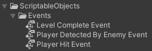
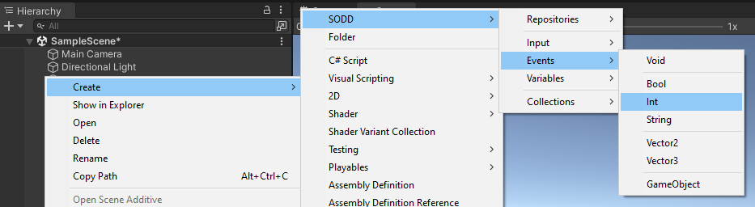
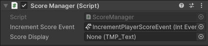

# Scriptable Events

## Concept

A Scriptable Event consists in a Scriptable
Object that holds a list of listeners, allowing for diverse systems within the game to
subscribe and unsubscribe to this list and raise the event, notifying the rest of
listeners. With this approach, each event in the game becomes a standalone entity
represented by a Scriptable Object.

In traditional game development paradigms, events are often tightly woven into the
fabric of the game's components, leading to a high degree of coupling and
interdependency. The approach of Scriptable Events, however, conceptualizes
events as independent modules, encapsulated within Scriptable Objects. This
modularization of events allows for a more dynamic and loosely coupled system
design, where various game components can react to events without being directly
bound to the event source.

In practical terms, an event could signify a change in the player’s health, the
completion of a level, or an enemy encounter. These Scriptable Events act then as
broadcasters, sending out signals when certain conditions in the game are met.



## How It Works

- **Event Creation**: A Scriptable Event is created as a ScriptableObject, defining an event that can carry an optional
  payload (data associated with the event). There are two ways to create these events:
    - From the **Create menu**: Right-click in the Project window, navigate to `Create > SODD > Events`, and select the
      desired event type (e.g., `IntEvent`).
    - From the **SODD menu**: In the main menu, go to `Tools > SODD > Events`, and choose the desired event type from
      the provided options.
- **Listeners**: Components interested in the event can register as listeners. These listeners are notified when the
  event is triggered.
- **Event Invocation**: The event can be invoked from any script, notifying all registered listeners and passing along
  the optional payload.
- **Event Debugging**: Scriptable Events have a built-in debug option that logs invocations to the console. This helps
  in tracking event triggers and payloads, making it easier to debug and understand event flow.
- **Event Testing**: Scriptable Events can be invoked directly from the Unity Inspector. This allows developers to test
  events without writing additional code. The Inspector provides an `Invoke` button and a field to enter the payload
  value, enabling quick and easy testing.

## Implementations in the Framework

The SODD Framework provides several implementations of Scriptable Events to cover various data types and use cases.
Below is a table detailing the core event types included in the framework:

| **Event Type**       | **Description**                                   |
|----------------------|---------------------------------------------------|
| **Void Event**       | An event with no payload.                         |
| **Bool Event**       | An event carrying a boolean payload.              |
| **Int Event**        | An event carrying an integer payload.             |
| **Float Event**      | An event carrying a float payload.                |
| **String Event**     | An event carrying a string payload.               |
| **Vector2 Event**    | An event carrying a 2D vector payload.            |
| **Vector3 Event**    | An event carrying a 3D vector payload.            |
| **GameObject Event** | An event carrying a GameObject reference payload. |

## Practical Example

Let's walk through a practical example of managing a player's score using an `IntEvent`.

### Step 1: Creating the Scriptable Event

First, we need to create a Scriptable Event that will signal when the player's score should be incremented.

1. Right-click in the Project window of Unity.
2. Navigate to `Create > SODD > Events > Int`.



3. Name the newly created event `IncrementPlayerScoreEvent`.

This Scriptable Event will now be used to notify the system whenever the player's score needs to be increased.


In the inspector window of the newly created `IncrementPlayerScoreEvent`, you can specify the payload, enable the debug
mode by checking the corresponding toggle, and invoke the event using the provided button.
By doing so, you will see a new entry in the Unity Console, which should detail the event type, the instance name, the
payload value, and a clickable link directing to the asset that triggered the event.


### Step 2: Creating the ScoreManager Script

Next, we'll create the `ScoreManager` script that will handle the score updates directly. This script will reference,
subscribe to, and unsubscribe from the `IncrementPlayerScoreEvent`.

Here’s the code for the `ScoreManager` script:

```csharp
public class ScoreManager : MonoBehaviour
{
    public Event<int> incrementScoreEvent; // Reference to the Scriptable Event
    public TMP_Text scoreDisplay; // Reference to the UI text component that displays the score

    private int score; // Variable to keep track of the player's score

    private void OnEnable()
    {
        // Subscribe to the event
        incrementScoreEvent.AddListener(OnScoreIncremented);
        // Update the score display with the initial score
        scoreDisplay.text = score.ToString();
    }

    private void OnDisable()
    {
        // Unsubscribe from the event
        incrementScoreEvent.RemoveListener(OnScoreIncremented);
    }

    // Method to update the score and refresh the UI display
    private void OnScoreIncremented(int increment)
    {
        score += increment; // Increase the score by the given increment
        scoreDisplay.text = score.ToString(); // Update the score display text
    }
}
```

Once the script is created:

1. Create a new GameObject in the scene (e.g., ScoreManager).
2. Attach the new `ScoreManager` script to this GameObject.
3. Add the reference to the `IncrementPlayerScoreEvent` scriptable event in the `ScoreManager` script.



At this point, if you start the game and invoke `IncrementPlayerScoreEvent` by clicking the `Invoke` button on the
inspector, you should see the score being updated in your UI component referenced by the `ScoreManager`.

### Step 3: Triggering the Event

We need a way to trigger the `IncrementPlayerScoreEvent` inside the game. For this example, let's assume the player
collects coins to
increase their score. Each coin will trigger the event when collected.

Here’s the code for the `Coin` script:

```csharp
public class Coin : MonoBehaviour
{
    public int scoreValue = 10; // Value to increase the score by
    public Event<int> incrementScoreEvent; // Reference to the Scriptable Event

    // Method called when another collider enters the trigger collider attached to this GameObject
    private void OnTriggerEnter(Collider other)
    {
        if (other.gameObject.CompareTag("Player")) // Check if the collider belongs to the player
        {
            incrementScoreEvent.Invoke(scoreValue); // Trigger the event with the score value
            Destroy(gameObject); // Destroy the coin GameObject
        }
    }
}
```

1. Create a Coin GameObject
2. Attach the new `Coin` script.
3. Add the reference to the `IncrementPlayerScoreEvent` scriptable event in the `Coin` script.


### Step 4: Testing the Setup

Now, let's test the setup to ensure everything works as expected.

1. Run the game in the Unity Editor.
2. When the player collides with a coin, the `IncrementPlayerScoreEvent` is invoked.
3. The `ScoreManager` script, which has subscribed to the event, will receive the notification.
4. The `OnScoreIncremented` method in the ScoreManager script will be called, updating the player's score and refreshing
   the UI display.

### Conclusion

By using Scriptable Events, we have successfully decoupled the `ScoreManager` and the `Coin` scripts. The `ScoreManager`
script does not need a direct reference to the `Coin` objects, nor does it need to know how or when the score increment
event is triggered. Similarly, the `Coin` script does not need to know about the existence of the `ScoreManager` or how
it
handles score updates. The role of the `IncrementPlayerScoreEvent` Scriptable Event is to act as a mediator that
facilitates communication between these independent components.
